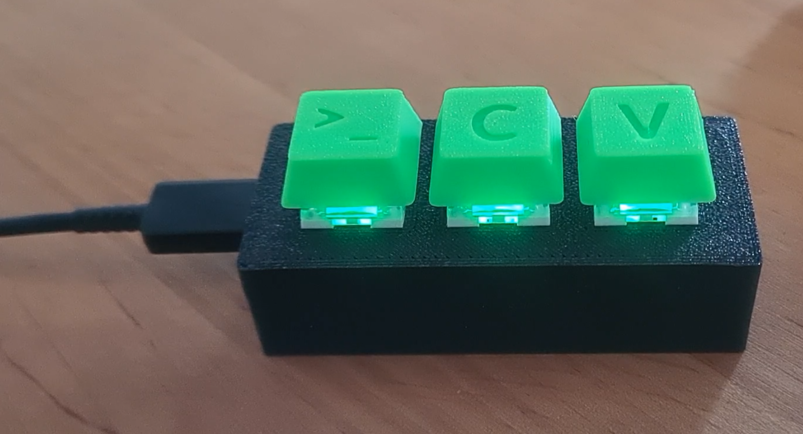
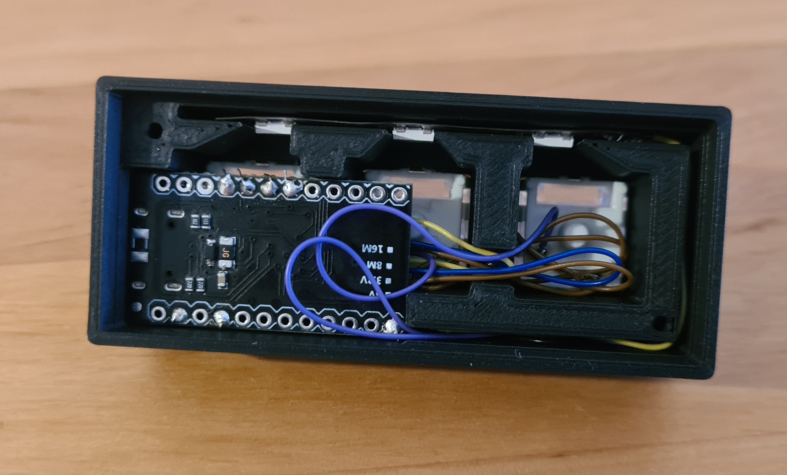

# DIY Macro Keyboard

A DIY macro keyboard project. This repository contains the Arduino source code and the STLs.

## Instructions

- Printables: Coming soon
- YouTube (1/2): Coming soon
- YouTube (2/2): Coming soon

## Electronics, you will need (affiliate links)

- 3 Cherry MX Keys: 
- Arduino Pro Micro: 
- A piece of a 60 LEDs/m Neopixyel strip: 
- 2 M2x8 screws: 

## Images

